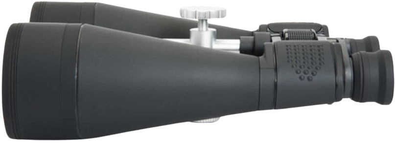

## Binoculars

 
[Binoculars](#binoculars) are often used because of their extensive portability. On a clear night, if the stars align (pardon the pun), they can be used to see the moons of Jupiter, the rings of Saturn, and the phases of Venus. They are also useful for scanning the Milky Way for star clusters, nebulae, and galaxies. [Binoculars](#binoculars) are also useful for scanning the horizon for comets and meteors.

In its inventory, the club has a pair of binoculars as well, namely, the Celestron Skymaster Binoculars (20x80), complete with its accessories like:

1. Objective Lens Caps
2. Rain Guard
3. Carrying Case
4. Neck Strap
5. Lens Cloth
6. Instruction Manual (might be misplaced :p)

 

