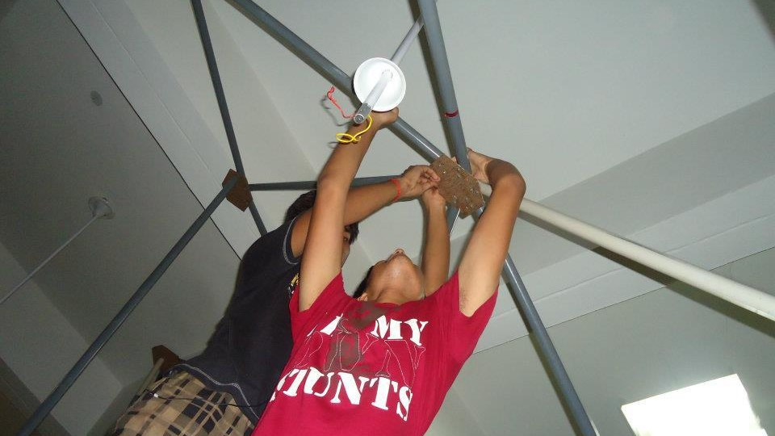
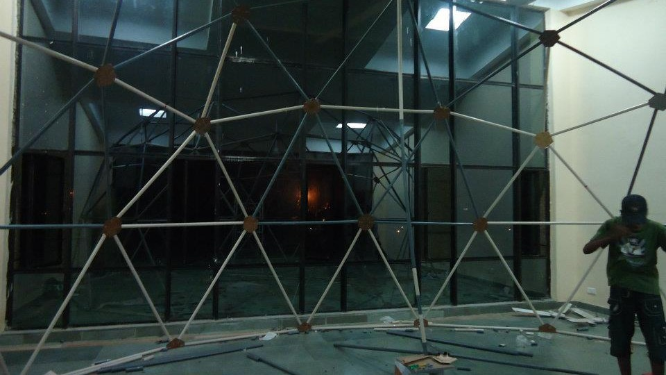
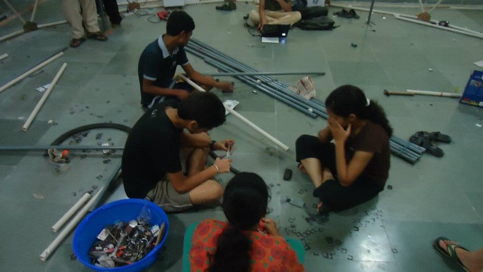
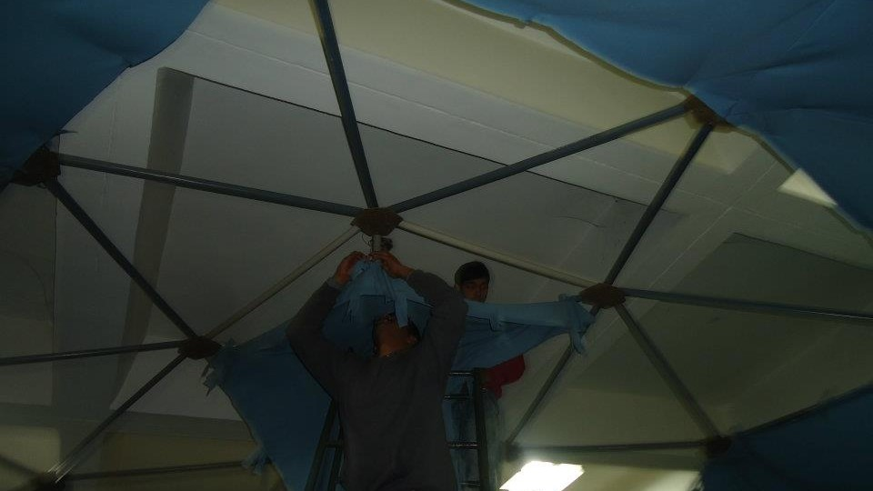
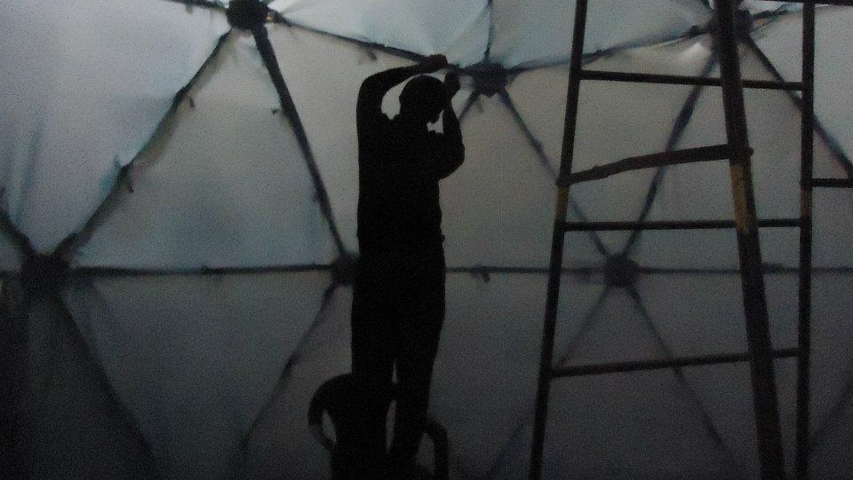
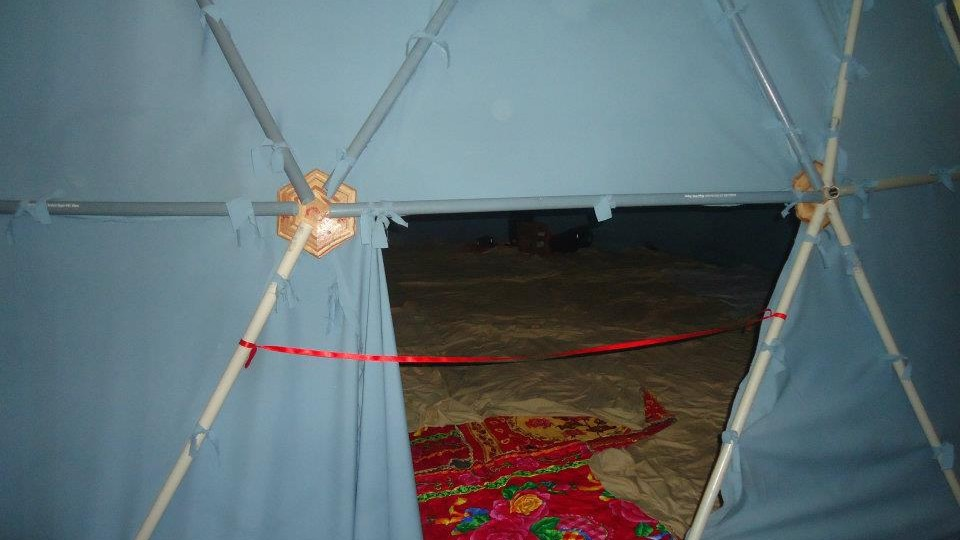
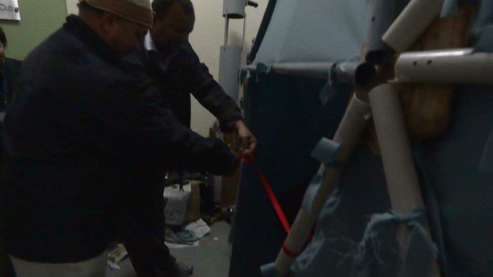
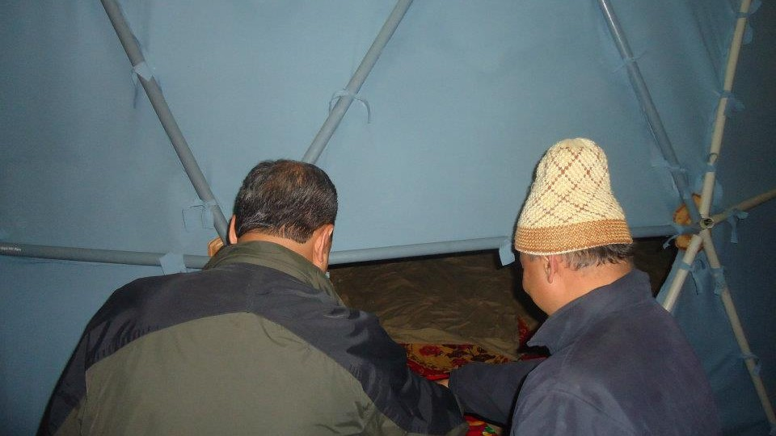
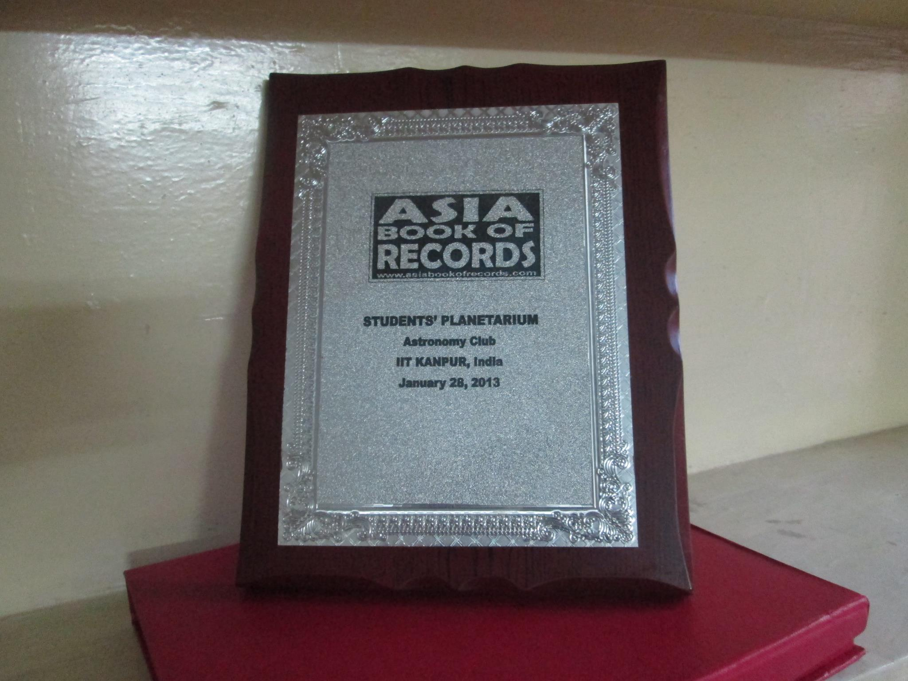
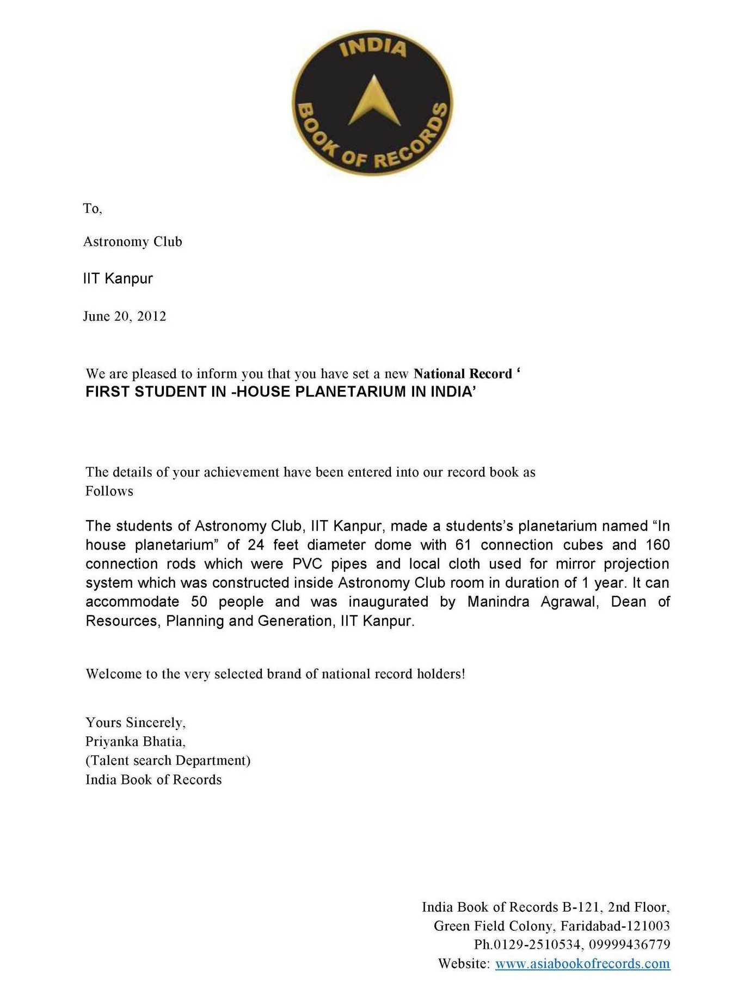

## Planetarium

 
Yes! We have a [planetarium](#planetarium)! In fact, the clubroom is a [planetarium](#planetarium). Fully equipped with a totally custom student-made 24 foot dome, Full HD projector, and 5.1 surround sound, the [planetarium](#planetarium) is a great place to watch movies, play games, or just hang out

Built in 2011-12 by the then [coordinators](../teams/recruitment.html#coordinator), [Nidhi Pashine](https://scholar.google.com/citations?user=rlE-OuUAAAAJ&hl=en), [Akshat Singhal](https://scholar.google.it/citations?user=8Ygv33wAAAAJ&hl=en), [Shubham Gupta
]() and their team of [secretaries](../teams/recruitment.html#secretary), the [planetarium](#planetarium) holds the [Asia Book of Records](#asia-book-of-records) for being the largest student-made [planetarium](#planetarium) in the world! Matter of fact, we've also got it [patented](https://www.iitk.ac.in/ipr/index.php/patent-filed) (**IN 730/DEL/2013**)!

### Construction

It all started on 1st July 2011, when an empty atop the New SAC room became Astronomy Club room. It was almost impossible to build a [planetarium](#planetarium) in open as there were possible risks of security and weather. Luckily room size was enough to accommodate the structure of [planetarium](#planetarium) which we planned.. Few pointers regaring the construction are:

1. Fans were removed to avoid hindrance with them and to avoid risk of accidental hazards. It was still warm and humid in Kanpur and it became very difficult to work there after that.
2. Rubber washers were made out of recycled cycle tire tube. They were practically free and easily available.
3. Pipes were joint with drilling nuts, bolts, metal washers and rubber washers (to reduce wear and tear) in the hubs.
4. Each pipes were connected manually. It was a time consuming and painful task. This was also causing lots of human error while constructing earlier but later they were resolved
5. 5 pipes were connected together using segments. Each segment was essentially a regular pentagonal base hun, making each pipe to be 72 degrees apart from each other and slightly elevated from the horizontal.
6. After the completion of 1st layer, it was difficult to construct manually in air, so we first fished some segments on ground and simply connected by drilling.
7. Later it was realized that the connecting rods were bending due to their own weight, so we removed few of them and tried to balanced the structure as much as possible.
8. Covering the [planetarium](#planetarium) from inside was a much bigger task. We tried to ensure that the covering should be uniform, wrinkle free, opaque enough with good reflecting property, light weighted and most importantly cheap. We did many experiments and finalized a material. After alot of hit and trial, we decided to cut the cloth in the individual triangular shape and tie them with the pipes.
9. To avoid entering of outside light, all the openings were manually sealed again. Openings were commonly occuring when two pieces of fabric were joined together, usually at a pipe.
10. 2 sides of the room were made up of glass and hence had lot of room to allow sunlight and moon light to enter the [planetarium](#planetarium). This way [planetarium](#planetarium) was not dark even in late night, so we covered them with newspaper. Because they are free and easily available.

A few shots of the club members constructing the planetarium are shown below:

### Projection System

For the [planetarium](#planetarium) to work, it was very important that it had come kind of spherical projection system. Unfortunately, spherical projectors cost **a lot**. So, we used a mirror projection system which mimics the similar effect.

As you might've read while preparing for JEE, a convex mirror diverges light rays. So, if we place a projector at the focus of a convex mirror, the light rays will be reflected in a way that they appear to be coming from the center of curvature of the mirror. This is exactly what we did. We placed a projector at the focus of a convex mirror and projected the image on the [planetarium](#planetarium) dome. The image was then reflected by the mirror and appeared to be coming from the center of curvature of the mirror, which was the center of the [planetarium](#planetarium) dome.

### Inauguration

The [planetarium](#planetarium) was inaugurated by [Dr. Mahindra Agarwal]() and the club's faculty advisor, [Dr. Pankaj Kumar Jain]() on the sixth of March, 2012, making it India's first [planetarium](#planetarium) built entirely by the student body.

### Asia Book of Records

 

