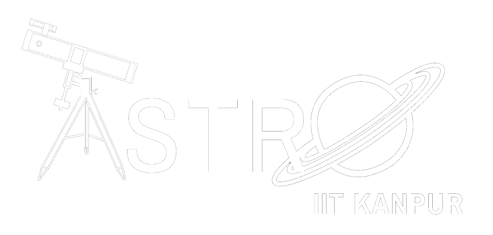
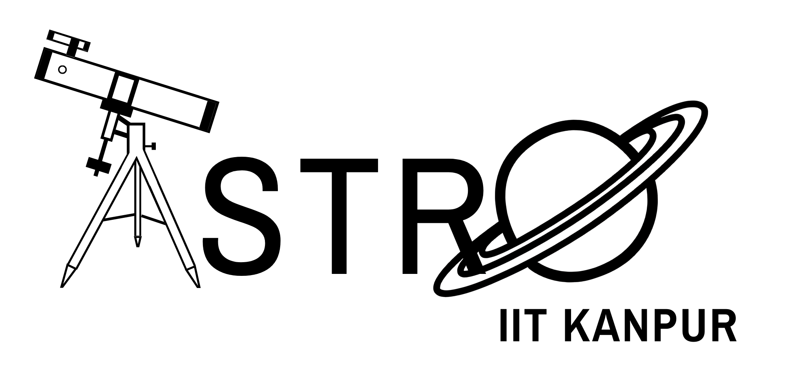
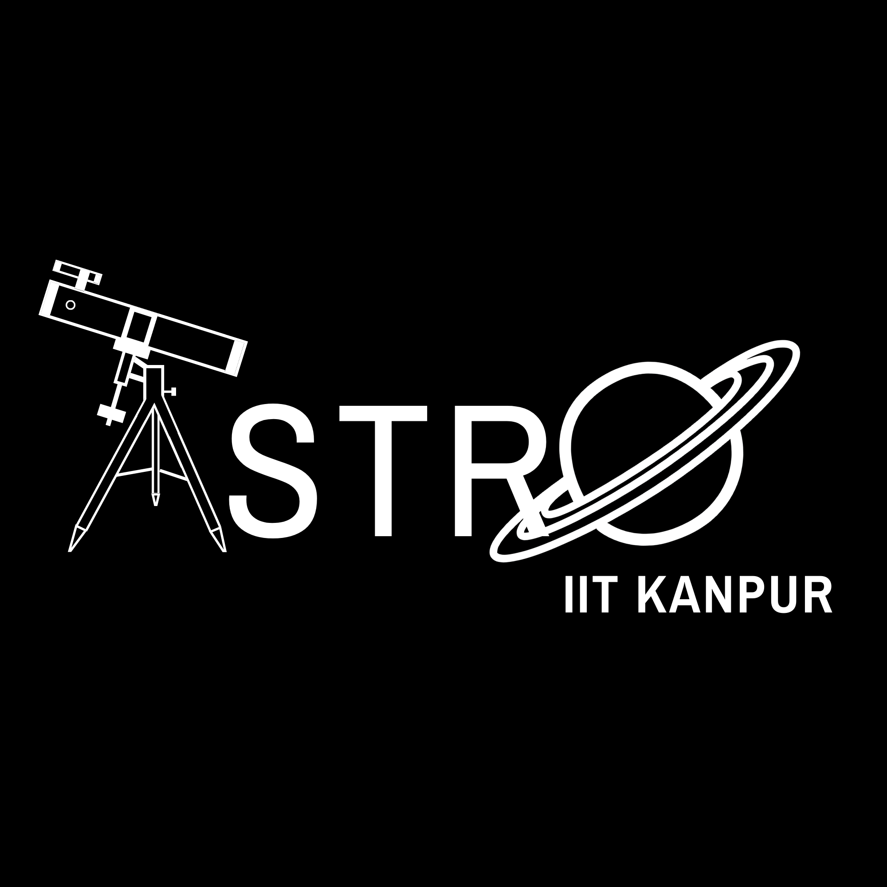
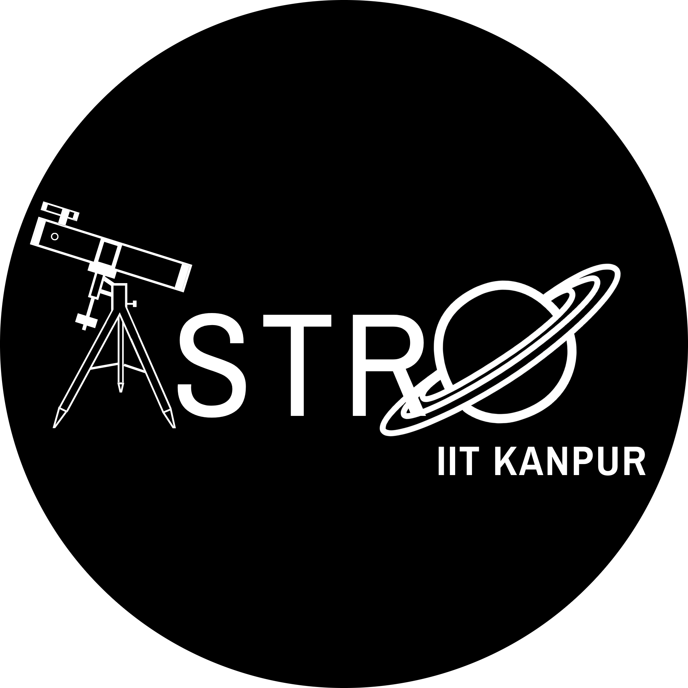

## Club Logos

 
Although there is only one single official logo of Astronomy Club, IIT Kanpur (the one atop this website), you'll find multiple versions of the club logo here and there. To better fit the design of whatever you're working on, we've provided a few different variants of the logo, which should cover the majority of use cases.

### White Logo: [[Download]](../assets/images/club/logos/logo-white.png)

 

### Black Logo: [[Download]](../assets/images/club/logos/logo-black.png)

 

### Square Logo: [[Download]](../assets/images/club/logos/logo-square.png)

 

### Circle Logo: [[Download]](../assets/images/club/logos/logo-circle.png)

 

