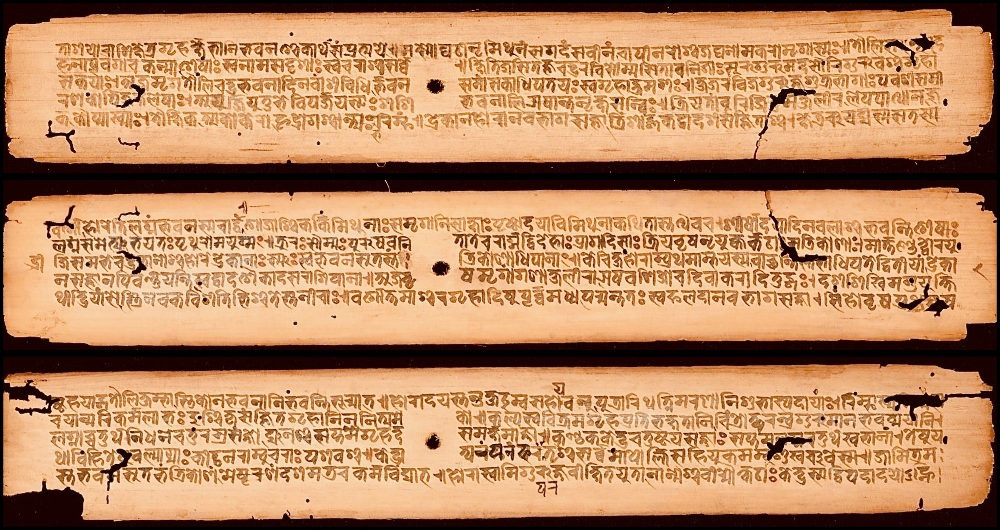
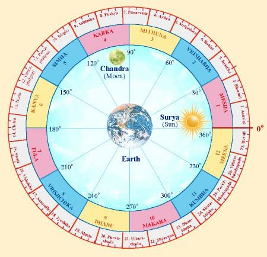

## Vedic History

Vedic culture indeed placed great importance on astronomy, which is evident in its sacred texts and practices. The celestial bodies like nakṣatras (constellations) and devas (heavenly beings) were integral to rituals and timekeeping. While not reliant on precise timekeeping devices like modern clocks, Vedic astronomy developed sophisticated ways to synchronize lunar and solar calendars, including the use of intercalary months to correct time discrepancies. Astronomy was one of the six Vedangas (auxiliary sciences) essential for understanding and maintaining the rituals and literature of the Vedas. The other Vedāṅgas included phonetics, rituals, etymology, grammar, and metrics.

### Nakshatras

The Rigveda describes the universe to be infinite. Of the five planets it mentions Brhaspati (Jupiter) and Vena (Venus) by name. The moon’s path was divided into 27 equal parts, although the moon takes about 27 $$\frac{1}{3}$$ days to complete it. Each of these parts was called a nakshatra. Specific stars or asterisms were also termed nakshatras. Śhatapatha Brāhmana relates a story about the nakshatras being as powerful as the sun in earlier times but that they have lost this power to the sun. In view of this the etymology nakshatra, ‘no power,’ is proposed. A favored modern etymology is nakshatra, ‘ruler over night.’ One ancient name of an astronomer is nakshatra darsa.

The Rigvedic reference to 34 lights apparently means the sun, the moon, the five planets, and the 27 nakshatras. In later literature the list of nakshatras was increased to 28. Constellations other than the nakshatras were also known; these include the Rksas (the Bears), the two divine Dogs (Canis Major and Canis Minor), and the Boat (Argo Navis). Aitreya Brāhmana speaks of Mriga (Orion) and Mrgavyadha(Sirius). The moon is called Surya Rasmi, one that shines by sunlight.

### The motions of the Sun and the Moon

Vedanga Jyotisa (VJ), the text that describes some of the astronomical knowledge of the times of altar ritual, has an internal date of 1350 B.C., obtained from its assertion that the winter solstice was at the asterism sravistha (Delphini). Recent archaeological discoveries support such an early date, and so this is great importance in the understanding of the earliest astronomy.
VJ describes the mean motions of the sun and the moon. This manual is available in two recensions: the earlier Rigvedic VJ (RVJ) and the later Yajurvedic VJ (YVJ). RVJ has 36 verses and YVJ has 43 verses. As the only extant astronomical text from the Vedic period, we describe its contents in some detail.

The measures of time used in VJ are as follows:

1 lunar year = 360 tithis

1 solar year = 366 solar days

1 day = 30 muhūrtas

1 muhūrta = 2 nādikās

1 nādikā = 10.005 kalās

1 day = 124 aḿsas (parts)

1 day = 603 kalās

Furthermore, five years were taken to equal a yuga. An ordinary yuga consisted of 1,830 days. An intercalary month was added at half the yuga and another at the end of the yuga.What are the reasons for the use of a time division of the day into 603 kalās? This is explained by the assertion that the moon travels through 1,809 nakshatras in a yuga. Thus the moon travels through one nakshatra in 610/603  sidereal days because 1,809×610/603 = 1,830 Or the moon travels through one nakshatra in 610 kalas.

### RESULTS AND DISCUSSION

### The Nine Planets (Navagrahas)

The Indians were worshiping the ‘Navagrahas’ (Nine planets) of the solar system, when the rest of the world did not know about planet.  The influences of the stars, planets and other celestial bodies of the cosmos on our existence are undeniable. It is believed that the ‘Navagrahas’ have a profound impact throughout our lifetime. Planetary positions and conjunctions at a given point in time can create, support and disrupt harmony in nature. Jyotisha-sastram, an important branch of Vedic studies also known as a Vedanga is a comprehensive study of how the various elements of the cosmos and their interplay affect our lives, individually and collectively. Seven of the nine planets are linked to the seven days of the week as per the Indian calendar and are also worshiped individually on these days. Stories and descriptions about the Navagrahas as well as their impact are found throughout our epics such as the Ramayana and the Mahabharata and Puranas.

### Age of Earth

Our ancient Srimad Bhagavad Gita estimated the age of earth as 4,320 million (4.32 billion) years. Carbon-dating undertaken some decades ago put the age of the earth at 5,000 million years. There is a little variation in computation of Srimad Bhagavad Gita before 5540 years. Manusmriti, a sacred book of ancient India says that the earth is more than 4 billion human years. Science says, it is 4.54 billion human years approximately.

As per Surya Siddhanta written in 800 CE, the duration of sidereal time in regard to Earth's revolution around the Sun is 365.2563789 days. It is only 1.4 seconds longer than the modern value of 365.2563627 days. This was the most accurate calculation of duration of sidereal time anywhere in the world over a thousand years.

### Hymn from the Sacred Texts

As per Hanuman Challisa (Prayer of Hindus) the distance between the Earth and the Sun is shown below. Hanuman Challisa was written by Goswami Tulasidas (born 15th century). Two lines of the Hindu prayer Hanuman Chalisa compute this distance with great simplicity.

जुगसहस्त्रयोजनपरभानु, लील्योताहहमधुरफलजानू

This means that the Sun (भानु) is at a distance of yuga Sahastra Yojanas (जुगसहस्त्रयोजन–Unit of distance in Sanskrit/Hindi).

According to the following conversion practices that are in use as per Hindu Vedic literature:

1 yuga = 12000 celestial years

1 sahastra = 1000

1 yojana = 8 Miles

Total Distance = yuga × sahastra × yojana = parabhaanu miles from the Earth to Sun

Total Distance = 12,000 × 1000 × 8 miles = 96,000,000 miles from the Earth to Sun

Or, Total Distance in kms = (96,000,000 miles × 1.6) kms = 153,600,000 kms from the Earth to the Sun (as 1 mile = 1.6 kms)

According to NASA, Earth's average distance to the sun is about 93 million miles.
